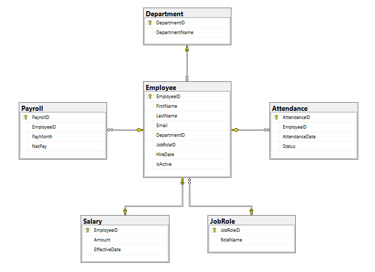
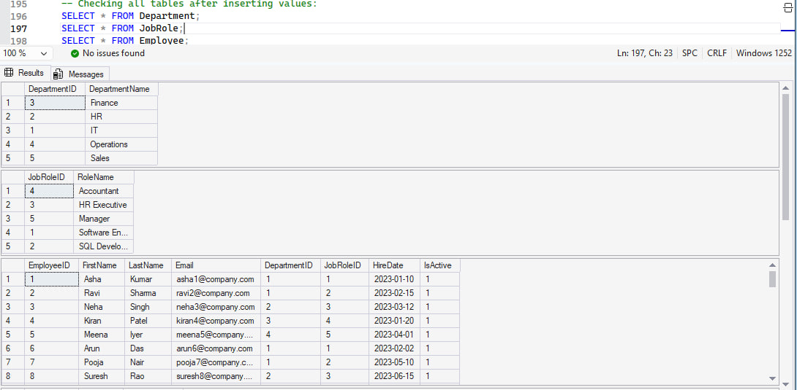

# Employee Management & Payroll System – SQL Server (T-SQL)

## 📌 Project Overview:
- This project demonstrates a complete SQL Server database system for managing employees, departments, payroll, and attendance.
- It includes database design, data insertion, reporting queries, stored procedures, functions, and indexing.

### ⚙️ Skills Demonstrated:

- SQL Server (T-SQL)
- Database design (3NF)
- Constraints (PK, FK, CHECK, UNIQUE)
- DDL + DML scripting
- Joins, subqueries, CTEs, window functions
- Stored procedures
- Scalar functions
- Indexes (Clustered & Nonclustered)

### 🧱 Schema Highlights:
📌 Dimension Tables:
- Department — Stores department names and codes
- JobRole — Job titles, grades, and department linkage
- Employee — Employee master data (personal + job + department)
📌 Fact Tables:
- Salary — Monthly salary structure (basic, HRA, PF, allowances)
- Attendance — Daily login/logout & working days
- Payroll — Final payroll calculations per month per employee
🔗 Relationships & Integrity:
- All tables linked with Primary–Foreign Key relationships
- Ensures full referential integrity through:
   - employee_id
   - department_id
   - jobrole_id
   - salary_id
- Implemented CHECK constraints, UNIQUE constraints, and default values (where needed)

### 📸 Snapshots:
📘 Data Model Diagram:

🧾 Creating and populating tables:
- Sample records:

### 📊 Reporting Queries Implemented:

- Employee list with department, role, salary
- Top 3 employees by salary (per department) using RANK()
- Employees earning above department average
- Latest salary using ROW_NUMBER()
- Department-wise payroll
- Payroll ranking using DENSE_RANK
- Employees with no payroll
- Attendance summary per employee
- Salary vs Department average

### 🛠 Stored Procedures:

- AddNewEmployee
- UpdateEmployeeSalary
- GetDepartmentPayrollReport
- GetEmployeeTotalPayroll (Output parameter)

### 🔢 Scalar Functions:

- GetFullName(EmpID)
- GetTotalPayroll(EmpID)

###⚡ Indexing:

- Nonclustered index on DepartmentID for faster department-wise queries.
- Clustered index automatically created on EmployeeID (PK).

## 📂 Project Structure: 
- `README.md` → Complete project documentation
- `A.EmpPayroll_CreatingTables.sql` → Database + 6 table creation scripts
- `B.EmpPayroll_InsertingValues.sql` → 50 employee records + salary + attendance + payroll
- `C.EmpPayroll_ReportingQueries.sql` → Joins, CTEs, window functions, subqueries
- `D.EmpPayroll_StoredProcedures.sql` → CRUD + salary update + payroll summary SPs
- `E.EmpPayroll_Functions.sql` → Full name & total payroll scalar functions
- `F.EmpPayroll_Indexes.sql` → Nonclustered index on DepartmentID
- `images/` →
  - `model.jpg` → ER diagram showing the relationships between the tables
  - `snap.jpg` → Snapshot of tables

### 🧠 Key Learnings:
- How to design normalized databases (3NF)
- Writing clean & optimized T-SQL code
- Using window functions for analytics
- Designing reusable stored procedures
- Improving performance with indexes
- Creating real-world payroll calculations

